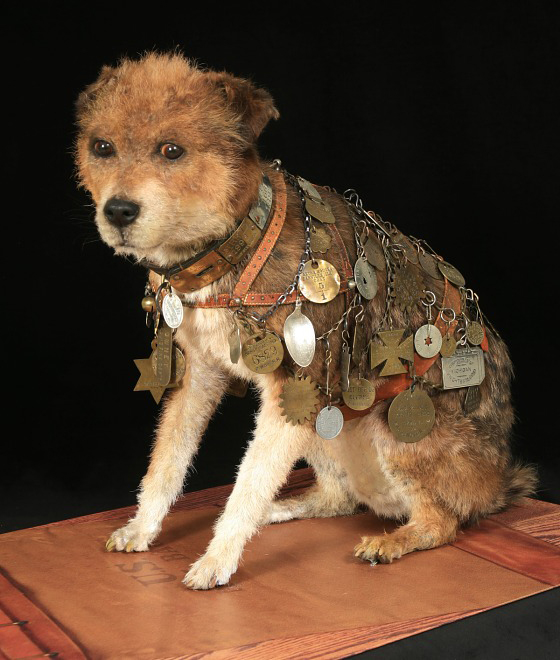
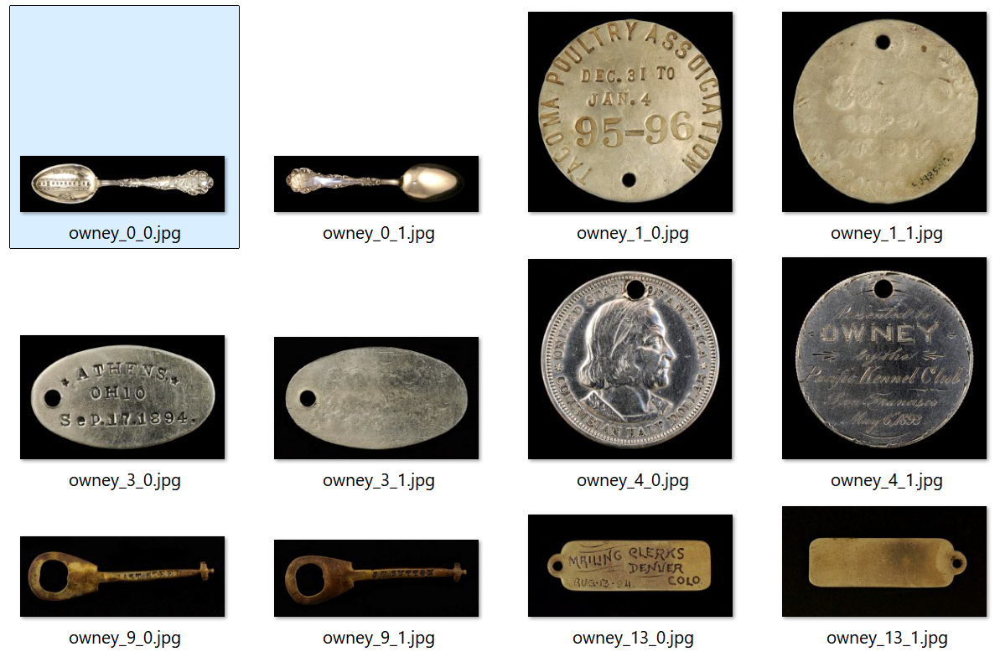
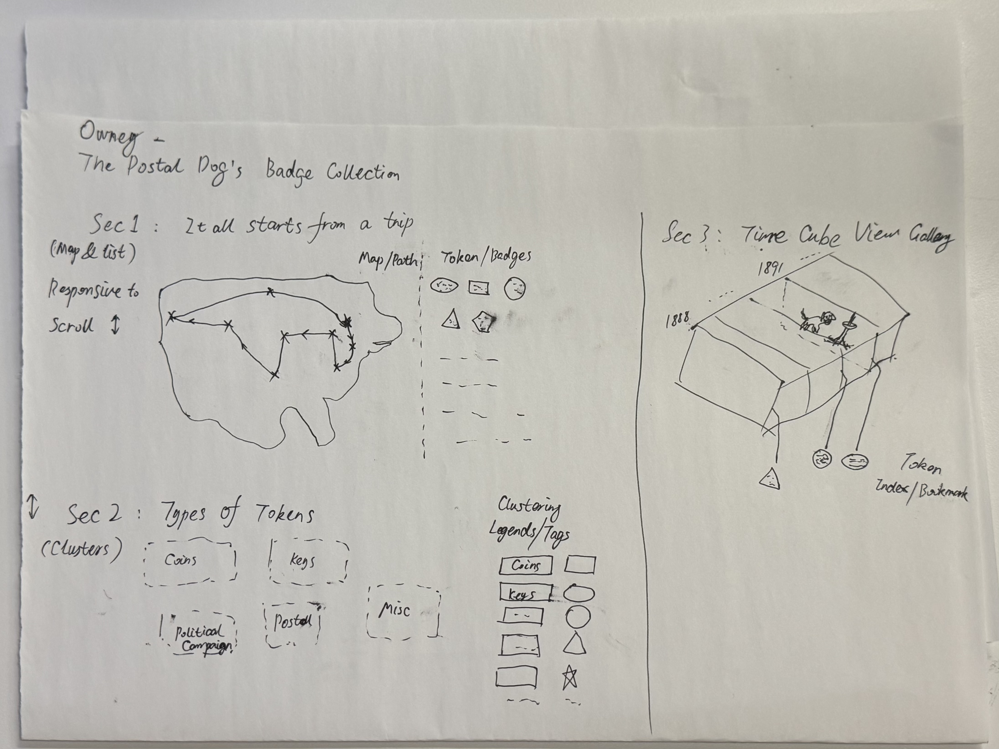
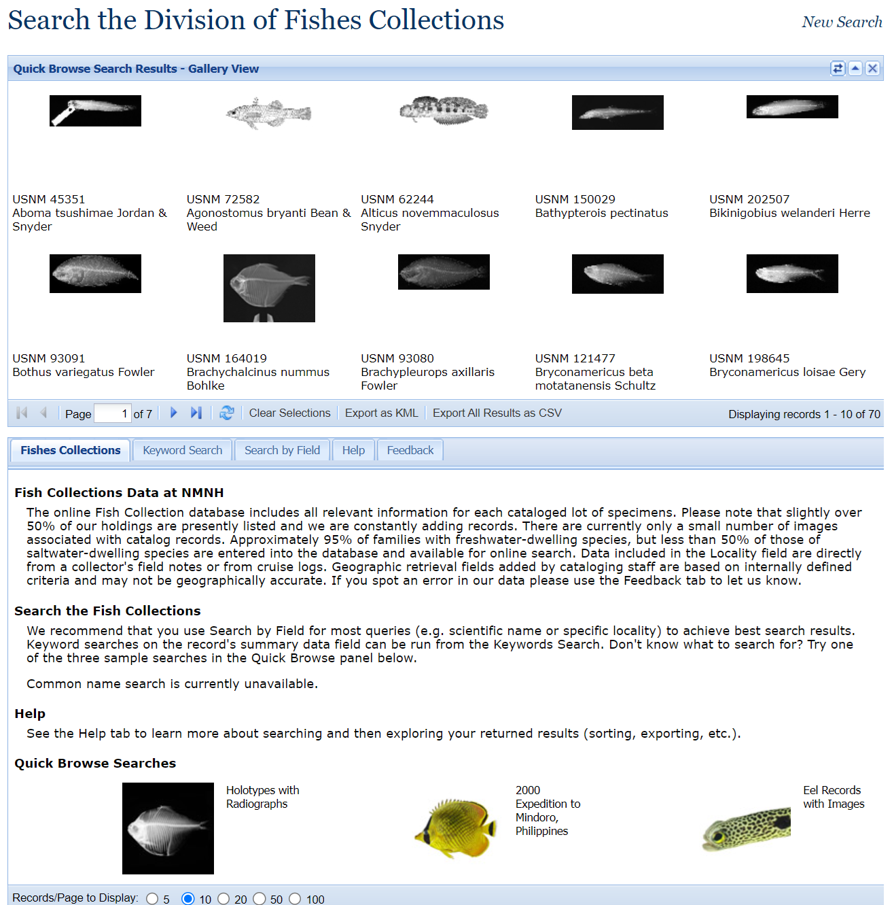
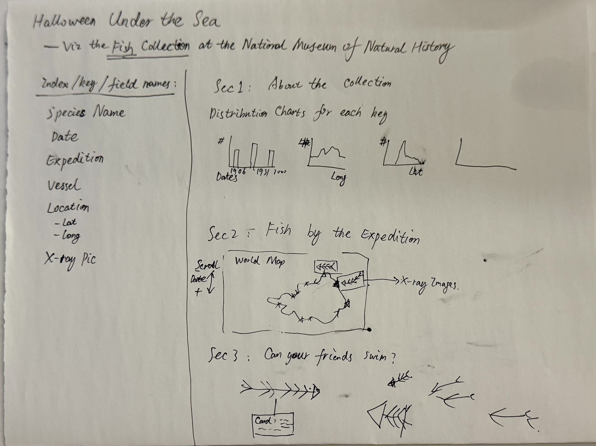
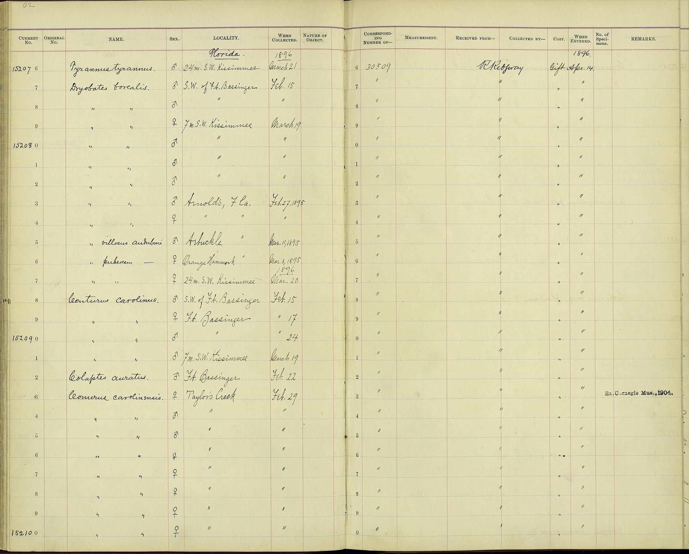
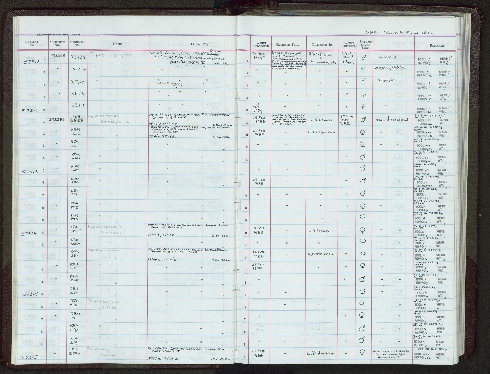
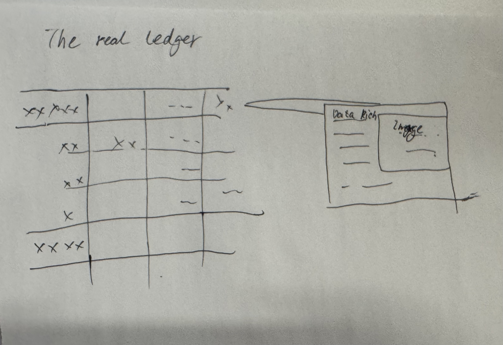

# Project-01
PSDV5200 MS1 Project 01

## Viz idea 1: Owney the Dog
Prototype: [Idea1-Owney](idea1-Owney/owney-visualization.html)
Data and background: https://postalmuseum.si.edu/exhibition/about-postal-operations-popular-culture-seals-symbols/owney-the-dog

## Viz idea 2: Halloween Under the Sea
Data and background: https://www.si.edu/collections/snapshot/shortsnout-scorpionfish-x-ray

## Viz idea 3: The real ledger

## Data/API res verification
- [Open data unit samples](si_data_unit_samples_english.html)
